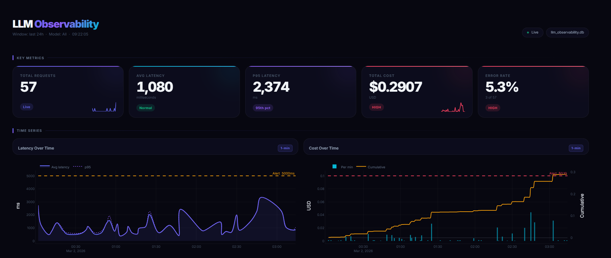

# LLM Observability Dashboard

A production-grade observability system for LLM applications built with FastAPI, Streamlit, Arize Phoenix, and multiple LLM providers (Anthropic, OpenAI, Google Gemini).

Tracks every LLM request and surfaces latency, cost, token usage, error rates, and quality metrics in a real-time dashboard — with automatic alerting, LLM-as-judge scoring, and A/B prompt testing.

---

## Dashboard Preview



---

## Architecture

```
┌─────────────────────────────────────────────────────────┐
│                     User / Client                        │
└──────────────┬─────────────────────────┬────────────────┘
               │ POST /api/v1/generate    │  Browser
               ▼                          ▼
┌──────────────────────┐     ┌───────────────────────────┐
│   FastAPI Backend    │     │  Streamlit Dashboard       │
│   :8000              │     │  :8501                     │
└──────────┬───────────┘     └──────────┬────────────────┘
           │                             │ direct SQLite read
           ▼                             │
┌──────────────────────┐                 │
│   ObservedLLM        │                 │
│   llm_wrapper.py     │                 │
│  · detect provider   │                 │
│  · time request      │                 │
│  · extract tokens    │                 │
│  · calculate cost    │                 │
│  · judge-score resp  │                 │
│  · emit OTel spans   │                 │
│  · fire alerts       │                 │
└──────┬───────────────┘                 │
       │                                 │
  ┌────┴─────────────────────────────────┤
  ▼                                      ▼
┌──────────────────┐     ┌──────────────────────────┐
│  SQLite / Postgres│     │  Arize Phoenix :6006     │
│  llm_requests    │     │  (OTel trace viewer)     │
└──────────────────┘     └──────────────────────────┘
           │
           ▼
┌──────────────────────────────────┐
│  AlertingService                 │
│  · Slack webhook                 │
│  · Discord webhook               │
│  · cooldown dedup                │
└──────────────────────────────────┘
```

**Design decisions**
- The Streamlit dashboard reads SQLite **directly** — it does not need the FastAPI server running.
- FastAPI exposes the REST API for external consumers and live generation.
- Arize Phoenix is **optional** — the app degrades gracefully to a console exporter.
- Alerting webhooks are **optional** — falls back to `logger.WARNING` if not configured.
- LLM-as-judge scoring is **opt-in** — set `JUDGE_ENABLED=true` to enable.

---

## Project Structure

```
LLM-Observability-Dashboard/
├── llm_observability/
│   ├── main.py                    # FastAPI app entry point
│   ├── core/
│   │   ├── config.py              # Pydantic Settings (env-driven)
│   │   ├── pricing.py             # Token cost calculator (Anthropic + OpenAI + Gemini)
│   │   └── llm_wrapper.py        # ObservedLLM — multi-provider instrumented wrapper
│   ├── db/
│   │   ├── database.py            # Async SQLAlchemy engine + incremental migrations
│   │   ├── models.py              # LLMRequest ORM model
│   │   └── crud.py                # Async CRUD + aggregate queries
│   ├── services/
│   │   ├── tracing_service.py     # OTel + Phoenix integration
│   │   ├── metrics_service.py     # Time-series aggregation
│   │   ├── alerting_service.py    # Slack / Discord webhook alerting
│   │   └── judge_service.py       # LLM-as-judge auto quality scoring
│   ├── api/
│   │   ├── schemas.py             # Pydantic request/response models
│   │   └── routes.py              # FastAPI router (includes A/B test endpoint)
│   └── dashboard/
│       └── app.py                 # Streamlit dashboard
├── scripts/
│   └── seed_data.py               # Generate 500 synthetic records
├── requirements.txt
├── .env.example
├── Makefile
└── README.md
```

---

## Prerequisites

- Python 3.11+
- An Anthropic API key (required for live generation and LLM-as-judge — not needed to view seeded data)
- An OpenAI API key (optional — only needed for `gpt-*` / `o1-*` models)

---

## Quick Start (5 steps)

```bash
# 1. Clone and enter the project
git clone https://github.com/KazukiNoSuzaku/LLM-Observability-Dashboard.git
cd LLM-Observability-Dashboard

# 2. Install dependencies
pip install -r requirements.txt

# 3. Configure environment
cp .env.example .env
# Edit .env and add your ANTHROPIC_API_KEY

# 4. Seed the database with 500 sample records
python scripts/seed_data.py

# 5. Open the dashboard
streamlit run llm_observability/dashboard/app.py
```

Visit **http://localhost:8501** to see the dashboard.

---

## Running the Full Stack

### Option A — Makefile (recommended)

```bash
# Terminal 1: API backend
make run-api

# Terminal 2: Streamlit dashboard
make run-dashboard

# Terminal 3 (optional): Arize Phoenix trace UI
make run-phoenix
```

### Option B — Manual commands

```bash
# Backend (FastAPI)
uvicorn llm_observability.main:app --host 0.0.0.0 --port 8000 --reload

# Dashboard (Streamlit)
streamlit run llm_observability/dashboard/app.py

# Phoenix (optional)
python -c "import phoenix as px; session = px.launch_app(); print(session.url); import time; time.sleep(86400)"
```

---

## Configuration Reference

### Core

| Variable | Default | Description |
|---|---|---|
| `ANTHROPIC_API_KEY` | — | Anthropic API key (Claude models + judge) |
| `OPENAI_API_KEY` | — | OpenAI API key (GPT / o1 / o3 models) |
| `DATABASE_URL` | `sqlite+aiosqlite:///./llm_observability.db` | SQLAlchemy async DB URL |
| `DEFAULT_MODEL` | `claude-haiku-4-5-20251001` | Default model |
| `MAX_TOKENS` | `1024` | Max completion tokens |
| `API_HOST` | `0.0.0.0` | FastAPI bind address |
| `API_PORT` | `8000` | FastAPI port |

### Tracing

| Variable | Default | Description |
|---|---|---|
| `PHOENIX_ENDPOINT` | `http://localhost:6006/v1/traces` | OTLP trace export endpoint |
| `PHOENIX_ENABLED` | `true` | Enable/disable Phoenix tracing |

### Alerting (Webhook)

| Variable | Default | Description |
|---|---|---|
| `SLACK_WEBHOOK_URL` | — | Slack Incoming Webhook URL (leave empty to disable) |
| `DISCORD_WEBHOOK_URL` | — | Discord Webhook URL (leave empty to disable) |
| `ALERT_COOLDOWN_SECONDS` | `300` | Min seconds between repeated alerts of the same type |
| `LATENCY_ALERT_THRESHOLD_MS` | `5000` | Fire alert when a request exceeds this latency |
| `COST_ALERT_THRESHOLD_USD` | `0.10` | Fire alert when a request exceeds this cost |

### LLM-as-Judge

| Variable | Default | Description |
|---|---|---|
| `JUDGE_ENABLED` | `false` | Auto-score responses after every generation |
| `JUDGE_MODEL` | `claude-haiku-4-5-20251001` | Model used for scoring (cheap/fast recommended) |

---

## API Endpoints

All endpoints are prefixed with `/api/v1`.
Interactive docs: **http://localhost:8000/docs**

| Method | Path | Description |
|---|---|---|
| `GET` | `/health` | Liveness probe |
| `POST` | `/api/v1/generate` | Generate a completion (tracked, multi-provider) |
| `GET` | `/api/v1/metrics/summary` | Aggregate summary metrics |
| `GET` | `/api/v1/metrics/requests` | Paginated request log |
| `POST` | `/api/v1/metrics/requests/{id}/feedback` | Attach feedback score |
| `GET` | `/api/v1/metrics/timeseries` | Time-bucketed series data |
| `GET` | `/api/v1/metrics/models` | Per-model breakdown |
| `POST` | `/api/v1/prompts` | Create a new prompt template version |
| `GET` | `/api/v1/prompts` | List all prompt templates |
| `GET` | `/api/v1/prompts/{name}` | Get all versions of a template |
| `GET` | `/api/v1/prompts/{name}/compare` | Compare metrics across versions |
| `POST` | `/api/v1/prompts/{name}/ab-generate` | Run A/B test across two versions |
| `DELETE` | `/api/v1/prompts/{name}/{version}` | Deactivate a template version |

### Example: generate with Claude

```bash
curl -s -X POST http://localhost:8000/api/v1/generate \
  -H "Content-Type: application/json" \
  -d '{"prompt": "What is observability?"}' | jq .
```

```json
{
  "response": "Observability is the ability to understand ...",
  "model": "claude-haiku-4-5-20251001",
  "provider": "anthropic",
  "latency_ms": 847.3,
  "prompt_tokens": 12,
  "completion_tokens": 94,
  "total_tokens": 106,
  "estimated_cost": 0.0000001445,
  "trace_id": "a3f8c21d-...",
  "error": null
}
```

### Example: generate with OpenAI

```bash
curl -s -X POST http://localhost:8000/api/v1/generate \
  -H "Content-Type: application/json" \
  -d '{"prompt": "What is observability?", "model": "gpt-4o-mini"}' | jq .
```

### Example: run an A/B test

```bash
curl -s -X POST http://localhost:8000/api/v1/prompts/summarizer/ab-generate \
  -H "Content-Type: application/json" \
  -d '{
    "prompt": "Summarise the benefits of observability.",
    "version_a": 1,
    "version_b": 2
  }' | jq .
```

```json
{
  "template_name": "summarizer",
  "result_a": { "version": 1, "latency_ms": 923, "estimated_cost": 0.00000012, ... },
  "result_b": { "version": 2, "latency_ms": 710, "estimated_cost": 0.00000009, ... }
}
```

---

## Multi-Provider Support

`ObservedLLM` auto-detects the provider from the model name — no configuration change needed beyond setting the right API key.

| Model prefix | Provider | API key env var |
|---|---|---|
| `claude-*` | Anthropic | `ANTHROPIC_API_KEY` |
| `gpt-*`, `o1-*`, `o3-*` | OpenAI | `OPENAI_API_KEY` |
| `gemini-*` | Google | `GOOGLE_API_KEY` (via `google-genai` package) |

```python
from llm_observability.core.llm_wrapper import ObservedLLM

# Anthropic (default)
llm = ObservedLLM()
result = await llm.generate("Explain async programming.")

# OpenAI
llm = ObservedLLM(model="gpt-4o-mini")
result = await llm.generate("Explain async programming.")
```

All providers write to the same `llm_requests` table with a `provider` column. The dashboard shows a **Provider Breakdown** donut chart.

---

## Alerting

Configure a Slack or Discord webhook and alerts fire automatically when latency or cost thresholds are breached.

```env
SLACK_WEBHOOK_URL=https://hooks.slack.com/services/T.../B.../xxx
DISCORD_WEBHOOK_URL=https://discord.com/api/webhooks/...
ALERT_COOLDOWN_SECONDS=300
LATENCY_ALERT_THRESHOLD_MS=5000
COST_ALERT_THRESHOLD_USD=0.10
```

Alerts include model name, provider, actual value, and threshold. A per-type cooldown prevents notification floods.

If no webhook is configured, alerts fall back to `logger.WARNING` so they always appear in server logs.

---

## LLM-as-Judge Quality Scoring

Enable automated response scoring with a single env variable:

```env
JUDGE_ENABLED=true
JUDGE_MODEL=claude-haiku-4-5-20251001
```

After every successful generation, the judge model scores the response on a 0–1 scale based on accuracy, completeness, and helpfulness. The score is stored in `feedback_score` and shown in the dashboard's **Avg Quality Score** KPI.

- Human-provided `feedback_score` always takes precedence (judge is skipped if one is supplied)
- The judge truncates prompts/responses to keep costs minimal (~$0.000002 per call with haiku)

---

## A/B Prompt Testing

The dashboard includes a dedicated **A/B Experiment** section. Pick any two versions of a template and see a head-to-head comparison:

- Requests, avg latency, avg cost, quality score, and error rate
- WIN badge on the better version in each metric
- Grouped bar chart with normalised values
- Automatic verdict: "v2 wins (2/3 metrics)"

To run a live A/B test via the API (both versions called simultaneously):

```bash
curl -X POST http://localhost:8000/api/v1/prompts/my-template/ab-generate \
  -H "Content-Type: application/json" \
  -d '{"prompt": "test prompt", "version_a": 1, "version_b": 2}'
```

---

## Dashboard Features

| Section | What you see |
|---|---|
| KPI cards | Total requests, avg/p95 latency, total cost, error rate with status badges and sparklines |
| Latency chart | Avg + p95 latency over time with alert threshold line |
| Cost chart | Per-minute cost bars + cumulative cost overlay |
| Token chart | Stacked prompt + completion tokens per minute |
| RPM chart | Requests per minute area chart |
| Latency histogram | Distribution with avg and p95 markers |
| Model donut | Request share by model |
| Provider donut | Request share by provider (Anthropic / OpenAI / Google) |
| Percentile KPIs | p50 / p99 latency, avg tokens, avg quality score |
| Request table | Searchable, filterable, truncated prompt/response preview |
| Prompt Version Control | Version-by-version latency / cost / feedback bar charts + summary table |
| A/B Experiment | Head-to-head comparison of two template versions with win/loss verdict |
| Auto-refresh | 10-second refresh toggle in sidebar |
| Phoenix link | One-click link to trace viewer |

---

## Arize Phoenix Tracing (Optional)

Phoenix provides a visual distributed trace explorer showing individual LLM spans with full attributes (latency, tokens, cost, prompt/response).

```bash
make run-phoenix
# Open http://localhost:6006
```

Every call to `ObservedLLM.generate()` automatically emits a span when `PHOENIX_ENABLED=true`. Each span includes:
- `llm.model` / `llm.provider`
- `llm.prompt_tokens` / `llm.completion_tokens`
- `llm.latency_ms`
- `llm.estimated_cost_usd`
- `llm.trace_id`

---

## Database Schema

```sql
CREATE TABLE llm_requests (
    id                      INTEGER  PRIMARY KEY AUTOINCREMENT,
    timestamp               DATETIME NOT NULL,          -- UTC
    prompt                  TEXT     NOT NULL,
    response                TEXT,
    model_name              VARCHAR(100) NOT NULL,
    provider                VARCHAR(50),                -- anthropic | openai | google
    latency_ms              FLOAT,                      -- NULL on error
    prompt_tokens           INTEGER,
    completion_tokens       INTEGER,
    total_tokens            INTEGER,
    estimated_cost          FLOAT,                      -- USD
    error                   TEXT,
    is_error                BOOLEAN  NOT NULL DEFAULT 0,
    feedback_score          FLOAT,                      -- 0.0 – 1.0 (human or judge)
    response_length         INTEGER,
    trace_id                VARCHAR(100),               -- links to OTel span
    prompt_template_id      INTEGER,                    -- FK to prompt_templates
    prompt_template_name    VARCHAR(100),
    prompt_template_version INTEGER,
    prompt_variables        TEXT                        -- JSON
);
```

Schema migrations are applied automatically on startup via `_migrate_columns()` in `database.py` — no migration tool required.

---

## Extending the Project

- **Add a new LLM provider**: Add a `_call_<provider>` method to `ObservedLLM` in `core/llm_wrapper.py` and extend `_detect_provider()`.
- **PostgreSQL**: Change `DATABASE_URL` to `postgresql+asyncpg://...` and `pip install asyncpg`.
- **PagerDuty / Teams alerting**: Extend `AlertingService` in `services/alerting_service.py`.
- **Custom judge prompts**: Edit `_SYSTEM_PROMPT` in `services/judge_service.py`.
- **LangSmith tracing**: Replace `TracingService` with a LangSmith callback handler and `@traceable` decorator.
- **Authentication**: Add `fastapi-users` or OAuth2 middleware to `main.py`.
